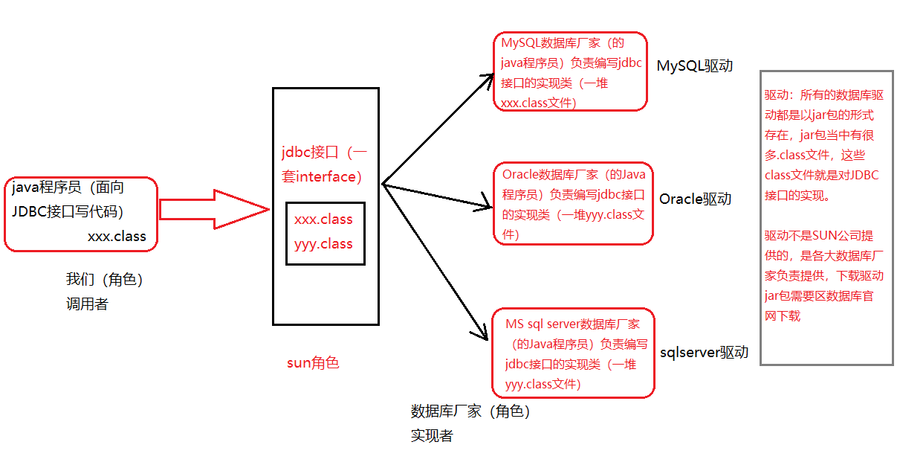

## JDBC是什么？

Java DataBase Connectivity(Java语言连接数据库)

## JDBC的本质是什么？

JDBC是SUN公司制定的一套接口（interface）

接口都有调用者和实现者。

面向接口调用、面向接口写实现类，这都属于面向接口编程

### 为什么要面向抽象编程

解耦合：降低程序的耦合度，提高程序的扩展力

多态机制就是非常典型的：面向抽象编程（不要面向具体编程）

### 为什么SUN指定了一套JDBC接口

因为每一个数据库的底层实现原理都不一样；

Oracle数据库有自己的原理；Mysql也是；每一个数据库产品都有自己的独特的实现原理

## JDBC开发前的准备工作

先从官网下载对应的驱动jar包，然后将其配置到环境变量classpath当中

`classpath=.;mysql的jar包路径;`

以上配置是针对文本编辑器的方式开发，使用IDEA工具的时候，不需要配置以上的环境变量，IDEA有自己的配置方式；