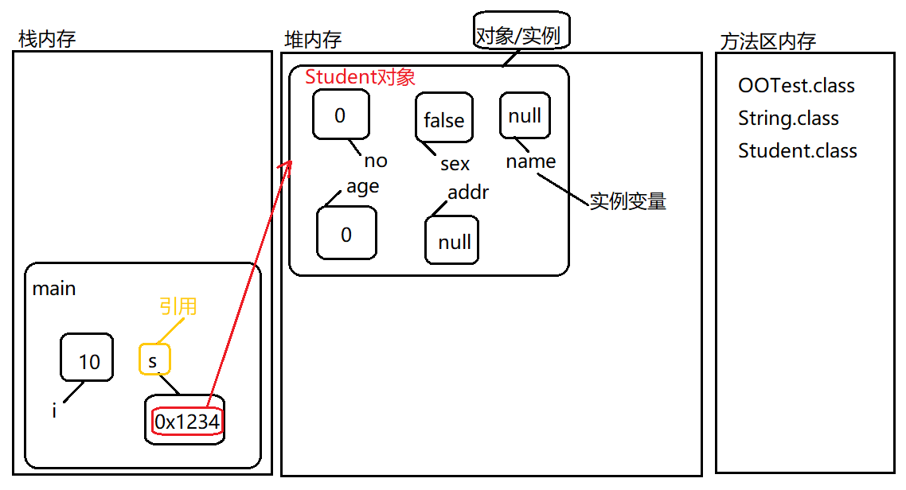

##  概述

变量在类体中，方法体之外，这种变量称为**成员变量**

但是成员变量不能直接通过类去访问，所以又被叫做**实例变量**

对象被称为实例，实例变量又被称为**对象变量**【对象级别的变量】

不创建变量，变量的内存空间是不存在的，只有创建了对象，这个变量内存空间才会创建。

## 对象的创建和使用

- 通过一个类可以实例化N个对象
- 实例化的语法：new 类名();
- new 是java语言中的一个运算符

### 新建对象的内存分配

new 运算符的作用是创建对象，在**JVM堆内存**当中开辟一块新的内存空间

> 方法去内存：在类加载的时候，class字节码代码片段被加载到该内存空间当中
>
> 栈内存（局部变量）：方法代码片段执行的时候，会给该方法分配内存空间，在栈内存中压栈
>
> 堆内存：new的对象在堆内存中存储。

### 解析新建对象和引用

```java
public class Student{
    int no;
    String name;
    int age;
    boolean sex;
    String addr;
}
//新建一个类Student,赋值给s
public class OOTest{
    public static void main(String[] args){
        int i =10
    // Student是一个引用数据类型
    // s是一个变量名
    // new Student()是一个学生对象
    // s是一个局部变量【在栈内存中存储】
		Student s = new Student();   
    }
 
}


```

- 新建类Student的时候，即使没有赋值，但是，我们知道基本数据类型或者引用数据类型都是由默认的值的，所以新建的Student类的属性其实都是有值的

  



#### 什么是对象？

new运算符在堆内存中开辟的内存空间称为对象

#### 什么是引用？

引用是一个变量，只不过这个变量中保存了另一个java对象的内存地址

> 在java语言中，程序员不能直接操作堆内存，java中没有指针，不像C语言
>
> 在java语言中，程序员只能通过引用区访问堆内存当中对象内存的实例变量。

:warning:

**局部变量在栈内存中存储**

**成员变量中的实例变量在堆内存的java对象内部存储。**

**实例对象是一个对象一份，一百个对象有一百份。**


实例变量不能直接采用`类名`的方式访问

因为实例变量是对象级别的变量，变量存储在java对象的内部，必须现有对象

通过对象才能访问实例变量，不能直接通过`类名`访问

## 内存分析

1. JVM(java虚拟机)主要包括三块内存空间，分别是：栈内存、堆内存、方法区内存

2. 堆内存和方法区内存各一个，而对于栈内存，一个线程有一个栈内存
3. 方法调用的时候，该方法所需要的内存在栈内存中分配，称为压栈。方法执行之后，该方法所属的内存空间释放，称为弹栈。
4. 栈中主要存储的是方法体当中的局部变量。
5. 方法的代码片段以及整个类的代码片段都被存储到方法区当中，在类加载的时候这些代码片段会被载入
6. 在程序执行过程中使用new运算符创建的Java对象，存储在堆内存中。对象内部有实例变量，所以实例变量存储在堆内存中。
7. 变量分类：
   - 局部变量【方法体中声明】
   - 成员变量【方法体外声明】
     - 实例变量【前边修饰符没有static】
     - 静态变量【前边修饰符中有static】
8. 静态变量存储在方法区内存当中。
9. 三块内存当中变化最频繁的是栈内存，最先有数据的是方法区内存，垃圾回收器主要针对的是堆内存。
10. 垃圾回收器【自动垃圾回收机制、GC机制】什么时候会考虑将某个java对象的内存回收？
    - 当堆内存当中的java对象称为垃圾数据的时候，会被垃圾回收器回收。
    - 什么时候堆内存中的java对象会变成垃圾呢？
      - 没有更多的引用指向它的时候
      - 整个对象无法被访问，因为访问对象只能通过引用的方式访问。

》通过一个实例[p117](https://www.bilibili.com/video/BV1Rx411876f?p=117)可以了解到：空引用（引用变量为null）访问“实例”相关的数据一定会出现空指针异常（NullPointerException）。

