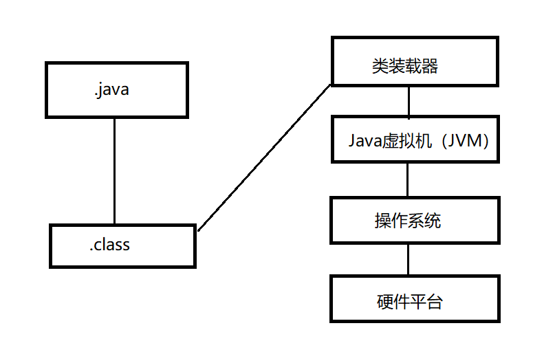

### Java程序的两个阶段

- 编译阶段

- 运行阶段

## 编译阶段

编译阶段主要的任务是检查Java源代码是否符合Java语法，符合Java语法则能够生成正常的字节码文件（xxx.class）;不符合Java语法规则，则无法生成字节码文件

> 字节码文件不是纯粹的二进制文件，这种文件无法再操作系统中直接执行

### 编译阶段的过程

其实就是把.java文件编译为.class文件

JDK中自带了javac.exe程序命令进行Java程序的编译

## 运行阶段

JDK中还自带了java.exe程序命令来运行编译后的字节码程序

```txt
#使用方法:java 类名；比如下面，运行a.class
java a
```

java.exe程序会启动java虚拟机（jvm），JVM会启动类加载器ClassLoader

ClassLoader会去硬盘上搜索(比如a.class)class文件，找到该文件则将该字节码文件装载到JVM当中。

JVM将字节码文件解释成二进制数据，然后操作系统执行二进制和底层硬件平台进行交互。