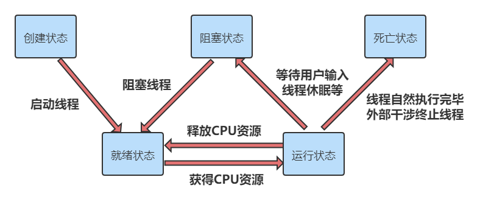
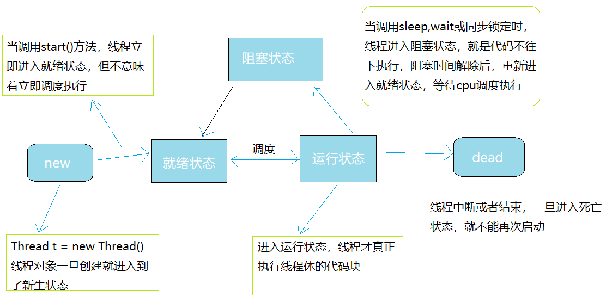

[toc]

# 线程的状态

**简易的图**



**详细的图**



## 线程的方法

- setPriority(int new Priority):更改线程的优先级
- static void sleep(long millis):在指定的毫秒数内让当前正在执行的线程休眠
- void join():等待改线程终止
- static void yield():暂停当前正在执行的线程对象，并执行其他线程
- void interrupt():中断线程，别种这种方式
- boolean isAlive():测试线程是否处于活动状态

## 停止线程

- 不推荐使用JDK提供的stop()、destroy()方法。【已废弃】
- 推荐线程自己停止下来
- 建议使用一个标志位进行终止变量。比如：当flay=false,则终止线程运行。

**示例代码**

```java
//测试stop
    //1.建议线程正常停止--->利用次数，不建议死循环
    //2.建议使用标志位--->设置一个标志位
    //3.不要使用stop或者destroy等过时或者JDK不建议使用的方法
public class TestStop implements Runnable{
    //1.设置一个标志位
    private boolean flay = true;

    @Override
    public void run() {
        int i = 0;
        while(flay){
            System.out.println("run......Thread"+i++);
        }
    }

    //2.设置一个公开方法停止吸纳从，转换标志位
    public void stop(){
        this.flay = false;
    }

    public static void main(String[] args) {
        TestStop testStop = new TestStop();
        new Thread(testStop).start();

        for (int i = 0; i < 1000; i++) {
            System.out.println("main"+i);
            if (i==900){
                //调用stop方法切换标志位，让线程停止
                testStop.stop();
                System.out.println("线程该停止了");
            }
        }
    }
}
```

## 线程休眠

- sleep(时间)指定当前线程阻塞的毫秒数；
- sleep存在异常InterruptedException;
- sleep时间达到后线程进入就绪状态
- sleep可以模拟网络延时，倒计时等。
- 每一个对象都有一个锁，sleep不会释放锁；

**示例代码**

```java
//模拟网络延时：放大问题的发生性
public class TestSleep implements Runnable {

    //票数
    private int ticketNums = 10;

    @Override
    public void run() {
        while (true){
            if (ticketNums<=0){
                break;
            }
            //模拟延时
            try {
                Thread.sleep(200);
            } catch (InterruptedException e) {
                e.printStackTrace();
            }
            System.out.println(Thread.currentThread().getName()+"-->拿到了第"+ticketNums--+"票");
        }
    }

    public static void main(String[] args) {
        TestSleep testSleep = new TestSleep();
        new Thread(testSleep,"小明").start();
        new Thread(testSleep,"老师").start();
        new Thread(testSleep,"黄牛").start();
    }
}
```

## 线程礼让

- 礼让线程，让当前正在执行的线程暂停，但不阻塞
- 将线程从运行状态转为就绪状态
- **让cpu重新调度，礼让不一定成功，看CPU心情**

 **示例代码**

```java
//测试礼让线程
    //礼让不一定成功，看CPU心情
public class TestYield {
    public static void main(String[] args) {
        MyYield myYield = new MyYield();
        new Thread(myYield,"A").start();
        new Thread(myYield,"B").start();
    }
}

class MyYield implements Runnable{
    @Override
    public void run() {
        System.out.println(Thread.currentThread().getName()+"线程开始执行");
        Thread.yield();//礼让
        System.out.println(Thread.currentThread().getName()+"线程停止执行");
    }
}
```

## 合并线程

- Join合并线程，此线程执行完成后，再执行其他线程，其他线程阻塞
- 可以想象成插队 

**示例代码**

```java
 //测试join方法--->想象插队
public class TestJoin implements Runnable{

    @Override
    public void run() {
        for (int i = 0; i < 500; i++) {
            System.out.println("线程vip来了"+i);
        }
    }

    public static void main(String[] args) {

        //启动我们的线程
        TestJoin testJoin = new TestJoin();
        Thread thread = new Thread(testJoin);
        thread.start();

        //主线程
        for (int i = 0; i < 1000; i++) {
            if (i==200){
                try {
                    thread.join();
                } catch (InterruptedException e) {
                    e.printStackTrace();
                }
            }
            System.out.println("main"+i);
        }
    }
}
```

## 线程状态观测

### Thread.State

线程状态。线程可以处于以下状态之一：

- NEW :尚未启动的线程处于此状态
- RUNNABLE：在Java虚拟机中执行的线程处于此状态
- BLOCKED：被阻塞等待监视器锁定的线程处于此状态
- WAITING：正在等待另一个线程执行特定动作的线程处于此状态
- TIMED_WAITING：正在等待另一个线程执行动作达到指定等待时间的线程处于此状态
- TERMINATED：已退出的线程处于此状态

一个线程可以在给定时间点处于一个状态。这些状态是不反映任何操作系统线程状态的虚拟机状态 

**示例代码**

```java
//观察测试线程的状态
public class TestState {
    public static void main(String[] args) throws InterruptedException {
        Thread thread = new Thread(()->{
           for (int i= 0 ;i<5;i++){
               try {
                   Thread.sleep(1000);
               } catch (InterruptedException e) {
                   e.printStackTrace();
               }
           }
            System.out.println("你好啊");
        });

        //观察状态
        Thread.State state = thread.getState();
        System.out.println(state); //new

        //观察启动后
        thread.start(); //启动线程
        state = thread.getState();
        System.out.println(state); //run

        while(state!=Thread.State.TERMINATED){
            //只要线程不终止，就一直输出状态
            Thread.sleep(100);
            state = thread.getState(); //更新线程状态
            System.out.println(state); //输出状态
        }

        thread.start();
    }
}
```

